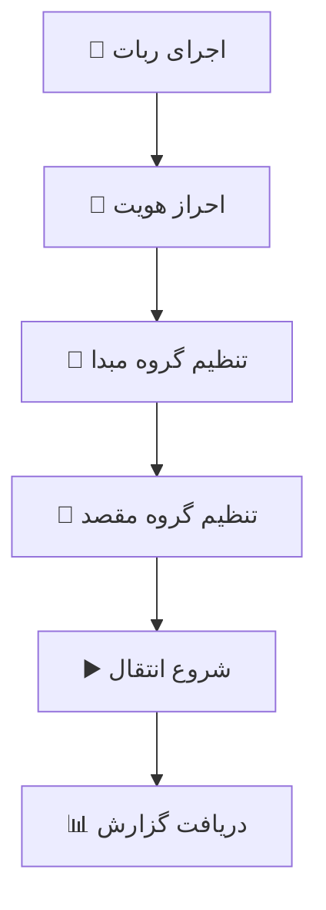

# 🚀 Telegram Member Transfer Bot | ربات انتقال اعضای تلگرام

<div align="center">


**🎯 ابزار قدرتمند برای انتقال اعضا بین گروه‌های تلگرام**


</div>

---

## 🌟 ویژگی‌ها

<table>
<tr>
<td>

### 🎨 **رابط کاربری**
- 🇮🇷 پشتیبانی کامل از زبان فارسی
- 💬 کامندهای ساده و قابل فهم
- 📱 سازگار با تلگرام موبایل و دسکتاپ
- 🔄 بازخورد لحظه‌ای از عملیات

</td>
<td>

### ⚡ **عملکرد هوشمند**
- 🤖 انتقال خودکار اعضا
- 📨 ارسال لینک دعوت هوشمند
- ⏸️ تنظیم تأخیر برای جلوگیری از بن
- 📊 گزارش‌دهی دقیق و مفصل

</td>
</tr>
<tr>
<td>

### 🛡️ **امنیت و پایداری**
- 🔐 احراز هویت امن
- 💾 ذخیره‌سازی تنظیمات
- ⚠️ مدیریت خطاهای تلگرام
- 🚫 محافظت در برابر محدودیت‌ها

</td>
<td>

### 🎯 **پشتیبانی گسترده**
- 👥 گروه‌های معمولی
- 🌐 سوپرگروه‌ها و کانال‌ها
- 🔗 لینک‌های دعوت عمومی و خصوصی
- 📈 آمارگیری کامل

</td>
</tr>
</table>

---

## 🚀 نصب سریع

### 📋 پیش‌نیازها
```bash
Python 3.7+
pip (Python Package Manager)
```

### 💻 مراحل نصب

1️⃣ **کلون کردن پروژه**
```bash
git clone https://github.com/Parsa013Ah/Gap-Mover.git
cd Gap-Mover
```

2️⃣ **نصب وابستگی‌ها**
```bash
pip install -r requirements.txt
```

3️⃣ **تنظیم API**
- به [my.telegram.org](https://my.telegram.org) بروید
- `API ID` و `API Hash` خود را دریافت کنید
- آنها را در فایل `telegram_bot.py` قرار دهید:

```python
API_ID = YOUR_API_ID
API_HASH = 'YOUR_API_HASH'
```

4️⃣ **اجرای ربات**
```bash
python main.py
```

---

## 📖 راهنمای استفاده

### 🎮 کامندهای اصلی

| کامند | عملکرد | مثال |
|--------|---------|-------|
| `.راهنما` | 📚 نمایش راهنمای کامل | در هر چت |
| `.تنظیم گروه مبدا` | 🎯 تنظیم گروه منبع | در گروه مبدا |
| `.تنظیم گروه مقصد` | 📍 تنظیم گروه مقصد | در گروه مقصد |
| `.شروع انتقال` | 🚀 شروع فرآیند انتقال | در هر چت |
| `.ارسال لینک` | 📨 ارسال لینک به غیر عضوها | در هر چت |
| `.تنظیم متن دعوت [متن]` | 📝 تنظیم متن سفارشی | در هر چت |
| `.وضعیت` | 📊 نمایش وضعیت فعلی | در هر چت |
| `.ریست انتقال` | 🔄 پاک کردن تنظیمات | در هر چت |

### 📱 مراحل استفاده



1. **احراز هویت**: شماره تلفن و کد تأیید را وارد کنید
2. **تنظیم مبدا**: وارد گروه منبع شوید و `.تنظیم گروه مبدا` بزنید
3. **تنظیم مقصد**: وارد گروه مقصد شوید و `.تنظیم گروه مقصد` بزنید
4. **شروع انتقال**: `.شروع انتقال` بزنید و منتظر نتیجه بمانید

### 📝 تنظیم متن دعوت سفارشی

می‌توانید متن دعوت خود را سفارشی کنید:

```bash
.تنظیم متن دعوت سلام {user_name} عزیز! گروه {source_group} به {dest_group} انتقال یافته: {invite_link}
```

**متغیرهای قابل استفاده:**
- `{user_name}` - نام کاربر (مثل: علی احمدی)
- `{source_group}` - نام گروه مبدا (مثل: گروه قدیم)  
- `{dest_group}` - نام گروه مقصد (مثل: گروه جدید)
- `{invite_link}` - لینک دعوت گروه

**مثال نتیجه نهایی:**
```
سلام علی احمدی عزیز! گروه CHAOS GP ✨ به گروه جدید ✨ انتقال یافته: https://t.me/newgroup
```

---

## 🎯 نحوه عملکرد

<div align="center">

```ascii
    📱 گروه مبدا          🤖 ربات          📱 گروه مقصد
         │                   │                   │
         │  1. دریافت اعضا   │                   │
         ├──────────────────>│                   │
         │                   │                   │
         │                   │  2. اضافه کردن    │
         │                   ├──────────────────>│
         │                   │                   │
         │  3. لینک دعوت     │                   │
         │<──────────────────┤                   │
         │                   │                   │
```

</div>

### ⚙️ الگوریتم هوشمند

1. **🔍 اسکن اعضا**: دریافت لیست کامل اعضای گروه مبدا
2. **➕ اضافه کردن مستقیم**: تلاش برای اضافه کردن مستقیم کاربر
3. **📨 ارسال لینک**: در صورت عدم امکان، ارسال لینک دعوت به پیوی
4. **⏸️ تأخیر هوشمند**: رعایت محدودیت‌های تلگرام
5. **📊 گزارش‌دهی**: ارائه آمار دقیق از نتایج

---

## 📊 نمونه خروجی

```bash
🤖 خوش آمدید به ربات انتقال اعضای تلگرام
==================================================
✅ با موفقیت وارد شدید به عنوان: کاربر نمونه

🚀 شروع انتقال اعضا...
📊 تعداد 150 عضو در گروه مبدا یافت شد.

✅ علی محمدی اضافه شد
✅ سارا احمدی اضافه شد
📨 لینک برای حسین رضایی ارسال شد
⏸️ استراحت 3 ثانیه...

🎉 انتقال اعضا تکمیل شد!

📊 آمار نهایی:
• کل اعضا: 150
• ✅ اضافه شده: 120
• 📨 لینک ارسال شده: 25
• ❌ خطا: 5

🎯 نرخ موفقیت: 96.7%
```

---

## ⚠️ نکات مهم

<div align="center">

| ⚡ **عملکرد** | 🛡️ **امنیت** | 📱 **سازگاری** |
|:---:|:---:|:---:|
| رعایت محدودیت‌های تلگرام | عدم نشت اطلاعات | تمام نسخه‌های تلگرام |
| بهینه‌سازی سرعت انتقال | احراز هویت امن | موبایل و دسکتاپ |
| مدیریت خطاهای شبکه | رمزنگاری ارتباطات | لینوکس، ویندوز، مک |

</div>

### 🔐 **الزامات امنیتی**
- ✅ دسترسی ادمین در هر دو گروه
- ✅ حساب کاربری معتبر تلگرام
- ✅ اتصال پایدار به اینترنت

### 📈 **محدودیت‌ها**
- 🚫 حداکثر 200 کاربر در هر اجرا (قابل تنظیم)
- ⏱️ تأخیر 2-5 ثانیه بین هر عضو
- 🔄 امکان توقف و ادامه عملیات

---

## 🛠️ سفارشی‌سازی

### 🎨 تغییر پیام دعوت
```python
# در خط 200 فایل telegram_bot.py
invite_message = f"""
سلام {user_name} عزیزم! 
گروه ما انتقال پیدا کرده 🚀
خوشحال میشیم در گروه جدید ببینیمتون 💖

{invite_link}
"""
```

### ⏰ تنظیم تأخیر
```python
# تأخیر بین اعضا (ثانیه)
MIN_DELAY = 2
MAX_DELAY = 5
```

### 📊 تغییر تعداد اعضا در هر بچ
```python
# گزارش پیشرفت هر چند عضو
PROGRESS_REPORT_INTERVAL = 10
```

---

## 🔧 عیب‌یابی

### ❌ خطاهای رایج

<details>
<summary><b>خطای احراز هویت</b></summary>

```bash
# راه حل:
1. API ID و Hash را بررسی کنید
2. شماره تلفن را درست وارد کنید
3. کد تأیید را سریع وارد کنید
```

</details>

<details>
<summary><b>خطای دسترسی ادمین</b></summary>

```bash
# راه حل:
1. در هر دو گروه ادمین باشید
2. دسترسی "افزودن کاربران" را داشته باشید
3. گروه‌ها را مجدداً تنظیم کنید
```

</details>

<details>
<summary><b>خطای محدودیت</b></summary>

```bash
# راه حل:
1. تأخیر بیشتری تنظیم کنید
2. تعداد کمتری کاربر منتقل کنید
3. چند ساعت صبر کنید
```

</details>

---

## 📈 آمار پروژه

<div align="center">


</div>

---

## 🤝 مشارکت

### 💡 نحوه مشارکت

1. **Fork** کردن پروژه
2. **Branch** جدید ایجاد کنید (`git checkout -b feature/AmazingFeature`)
3. تغییرات را **Commit** کنید (`git commit -m 'Add some AmazingFeature'`)
4. به Branch خود **Push** کنید (`git push origin feature/AmazingFeature`)
5. **Pull Request** ایجاد کنید

### 🎯 راه‌های مشارکت

- 🐛 گزارش باگ‌ها
- 💡 پیشنهاد ویژگی‌های جدید
- 📝 بهبود مستندات
- 🔧 بهینه‌سازی کد
- 🌍 ترجمه به زبان‌های مختلف

---

## 📞 پشتیبانی

<div align="center">

### 🆘 راه‌های دریافت کمک

| روش | لینک | زمان پاسخ |
|-----|------|----------|
| 🐛 **GitHub Issues** | [Issues](https://github.com/Parsa013Ah/Gap-Mover/issues) | 24 ساعت |
| 💬 **Telegram** | [@POH013]https://t.me/POH013) | آنی |
| 📧 **Email** | parsah013@gmail.com | 48 ساعت |
</div>

---

## 📜 لایسنس

```
MIT License

Copyright (c) 2024 Parsa13Ah

مجوز استفاده، کپی، تغییر و توزیع این نرم‌افزار به صورت رایگان داده شده است.
```

---

## ⭐ تشکر ویژه

<div align="center">

---

### 🎉 اگر این پروژه برایتان مفید بود، حتماً ستاره بدهید!

[](https://github.com/Parsa013Ah/Gap-Mover)

**ساخته شده با ❤️ برای جامعه تلگرام ایران**

</div>

---

<div align="center">
<sub>🔄 آخرین به‌روزرسانی: دی 1403</sub>
</div>
